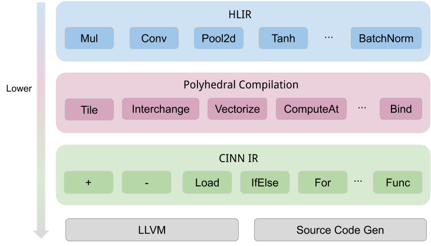

# CINN : Compiler Infrastructure for Neural Networks

The project CINN is a machine learning compiler and executor for multiple hardware. 
It is designed to provide multiple layers of APIs to make DNN computation graph easier to define,  faster to execute, and more convenient to extend with more hardware backends. Currently, it targets X86 CPUs and NVidia GPUs, and it is easy to extend.

This project is in active development. 

## Example

Let's take C++ APIs as an example, the corresponding Python APIs are available and just differ little.

### Load a PaddlePaddle model and execute

```c++
#include "cinn/frontend/executor.h"
using cinn::hlir::framework;

Executor executor({"input0"}/*list of inputs' names*/, 
                  {{1, 30}}/*list of inputs' shapes*/);
executor.LoadPaddleModel(/*string of model directory*/);
auto input_handle = executor.GetTensor("input0");
auto output_handle = executor.GetTensor("output0");
// set data to input_handle
executor.Run();
// get output content from output_handle
```

### Define a raw computation and execute

The following is a naive matrix-multiplication implementation

```c++
#include "cinn/cinn.h"
using namespace cinn;

Expr M(10), N(20), K(30);
Placeholder<float> A("A", {M, K});
Placeholder<float> B("B", {K, N});
// reduce axis
Var k(K.as_int32(), "k");

auto C = Compute({M, N},
                 [=](Expr i, Expr j) { return Sum(A(i, k) * B(k, j)); }, 
                 "C", {k});

auto stages = CreateStages({C});
C->InitReduction(stages, Expr(0.f)); // Initialize C to zero before compuation.

// some schedule to optimize the code
stages[C]->Tile(0, 1, 4, 4); // Tile the 0-th and 1-th axis with the block size as 4.
```


## How it works

CINN lowers a traditional neural network model into a two-level intermediate representation(IR). The high-level IR(HLIR) helps to define some domain-specific computation and perform some overall optimization on the IR-graph; the lower-level IR(CINN IR) helps to represent symbolic arithmetic and finally map to a hardware backend.

CINN is based on the polyhedral compilation thus it can extend with more loop optimizations. The schedule transform is applied between the lowering from HLIR to CINN IR.

The overall architecture is as follows




##  Getting Started


## License

CINN is licensed under the Apache 2.0 License.
